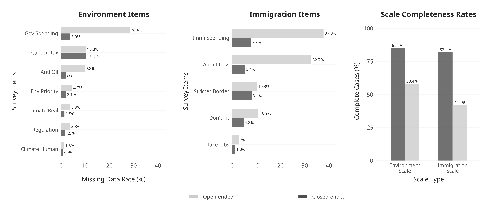
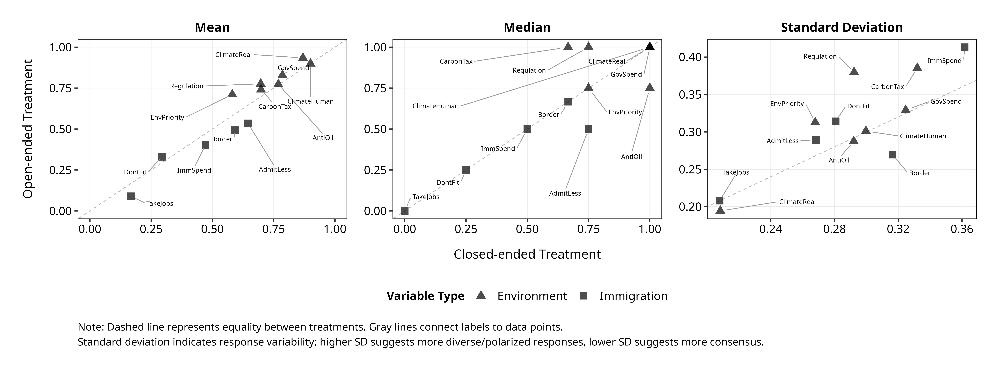
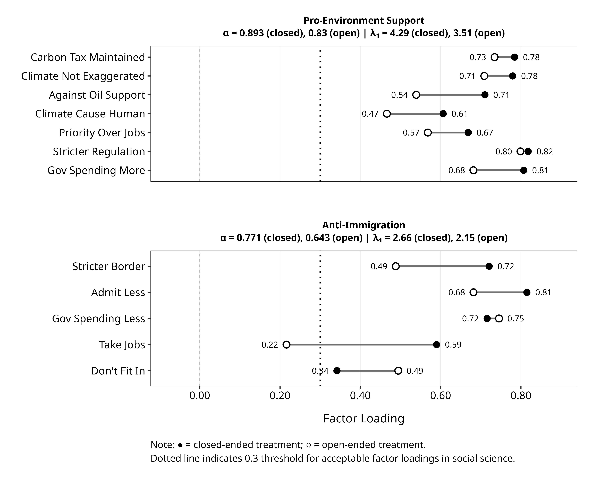
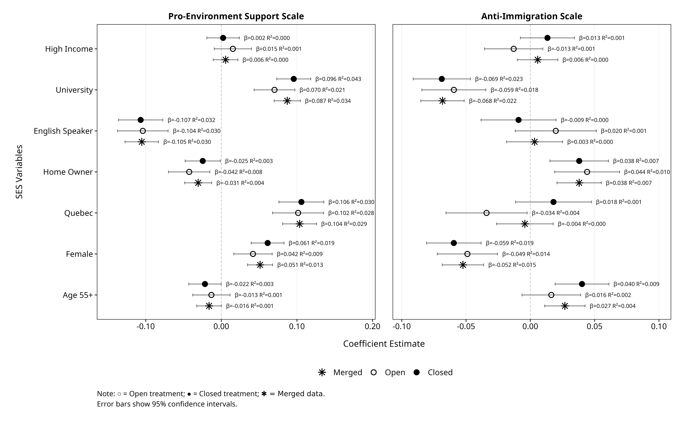
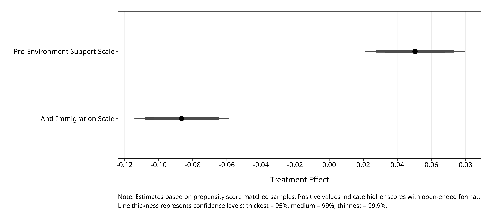
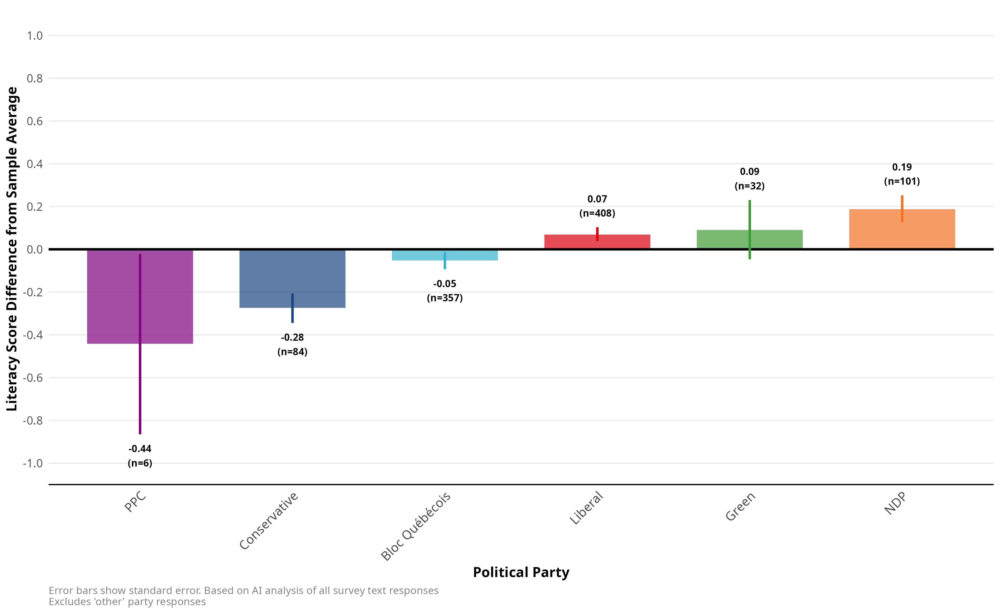
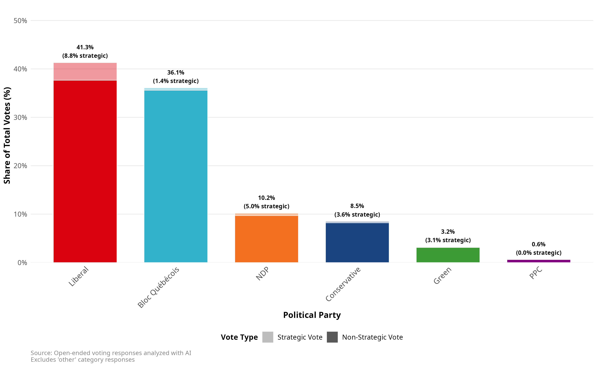

```{r setup}
#| include: false
library(tidyverse)
library(scales)
library(psych)
library(haven)

# Charger les données et convertir les labels
df_ai <- readRDS("data/df_clean_with_ai_t0.1_n10.rds") %>%
  mutate(across(where(is.labelled), zap_labels))

# Séparer par condition
df_closed <- df_ai %>% filter(assignment == "closed")
df_open <- df_ai %>% filter(assignment == "open")

# Variables environnementales et immigration
env_vars_closed <- c("env_spending", "env_regulation", "env_priority",
                     "env_cause", "env_oil", "env_exaggerated", "env_carbon_tax")
env_vars_ai <- paste0(c("env_spending", "env_regulation", "env_priority",
                        "env_cause", "env_oil", "env_exaggerated", "env_carbon_tax"), "_ai_t0.1_n10")

immi_vars_closed <- c("immi_integration", "immi_take_jobs", "immi_spending", "immi_more", "immi_border")
immi_vars_ai <- paste0(c("immi_integration", "immi_take_jobs", "immi_spending", "immi_more", "immi_border"), "_ai_t0.1_n10")

# Calculer les N
n_total <- nrow(df_ai %>% filter(assignment %in% c("closed", "open")))
n_closed <- nrow(df_closed)
n_open <- nrow(df_open)

# Couleurs
colors <- list(
  primary = "#1a1a2e",
  accent = "#e94560",
  accent2 = "#0f3460",
  teal = "#16c79a",
  gold = "#f5a623"
)

# Créer les données et les échelles (moyenne des items, normalisées 0-1)
env_closed_data <- df_closed %>% select(all_of(env_vars_closed))
immi_closed_data <- df_closed %>% select(all_of(immi_vars_closed))
env_open_data <- df_open %>% select(all_of(env_vars_ai))
immi_open_data <- df_open %>% select(all_of(immi_vars_ai))

calc_scale <- function(data) {
  data %>%
    mutate(across(everything(), ~./10)) %>%
    rowMeans(na.rm = FALSE)
}

env_scale_closed <- calc_scale(env_closed_data)
env_scale_open <- calc_scale(env_open_data)
immi_scale_closed <- calc_scale(immi_closed_data)
immi_scale_open <- calc_scale(immi_open_data)
```

## {background-color="#1a1a2e"}

::: {style="text-align: center; margin-top: 8vh;"}

[FROM CHECKBOX TO TEXTBOX]{style="font-size: 1.8em; font-weight: 700; color: white; letter-spacing: 0.05em;"}

<br>

[Les LLMs peuvent-ils traiter les réponses ouvertes pour]{style="font-size: 0.85em; color: #aaa;"}
[mesurer les mêmes facteurs latents que les questions fermées?]{style="font-size: 0.85em; color: #aaa;"}

<br><br>

[RDV de la science politique| 2026]{style="font-size: 0.6em; color: #666;"}

:::

## La tension méthodologique : Ouvert vs Fermé

Le débat sur la mesure des attitudes oppose traditionnellement deux impératifs [@lazarsfeld44; @schuman_presser96] :

- **Standardisation (Fermé)** : Facilite la comparaison et réduit l'effort cognitif du répondant.
- **Spontanéité (Ouvert)** : Capture le cadre de référence (frame) de l'individu sans imposer celui du chercheur.

::: {.fragment}
Malgré les avantages théoriques de l'approche ouverte pour la validité de construit, son utilisation reste marginale :

> "Collection and especially analysis of open-ended data are relatively rare [...] and almost exclusively done through human coding."
> — @roberts_etal14
:::

## Dilemmes de validité et biais de mesure

L'avantage empirique des questions ouvertes n'est pas absolu. Elles présentent des biais spécifiques :

- **Biais d'éloquence** : La réponse mesure-t-elle l'intensité de l'attitude ou la capacité rhétorique à l'articuler ?
- **Non-réponse** : Le silence signale-t-il une absence d'opinion ou une surcharge cognitive ?

::: {.fragment}
À l'inverse, la question fermée peut "aider" le répondant :
:::

::: {.fragment}
*Exemple : "Most Important Problem" [@schuman_presser96]*
Des enjeux comme la criminalité émergent souvent dans les questions fermées (activation d'une inquiétude latente) alors qu'ils sont omis spontanément (défaut d'accessibilité).
:::

## Le dilemme du cadre de référence [@schuman_presser96]

La question fermée définit la tâche pour le répondant, créant une tension :

:::: {.columns}

::: {.column width="50%"}
**1. Clarification**
*(L'apport)*

- Établit un **cadre commun**
- Réduit l'ambiguïté (évite le vague)
- Fournit les mots pour l'exprimer
:::

::: {.column width="50%"}
**2. Imposition**
*(Le risque)*

- Impose le cadre du **chercheur**
- Suggère des réponses artificielles
- Biais de désirabilité sociale
:::

::::

::: {.fragment}
**Conclusion :**
On préfère souvent le fermé par **faisabilité analytique**, malgré le risque d'imposition.
:::

## Le coût analytique : L'exemple "The Beatles"

Pourquoi les questions ouvertes sont-elles si coûteuses ? Prenons un exemple trivial tiré d'une question de sondage récente ($N=2000$) sur le groupe de musique préféré.

La réponse la plus populaire ($n=75$) apparaît sous **10 variations distinctes** :

> "the beatles", "The Beatles", "The beatles", "The Bwatles", "beatles", "Beatles", "beetles", "Beetles", "les beattels", "Les Beatles".

::: {.fragment}
**Le constat méthodologique :**
Même pour une entité simple, la variabilité textuelle rend les données brutes inutilisables sans nettoyage intensif.
:::

::: {.fragment}
Les approches classiques (mots-clés, Regex, LDA, STM) échouent à capturer ces variations ("The Bwatles") sans un effort de programmation disproportionné, forçant souvent un retour au codage manuel.
:::

## {background-color="#0f3460"}

::: {style="text-align: center;"}

[Exercice: Codez ces réponses]{style="font-size: 1.5em; font-weight: 700; color: white;"}

:::

:::: {.columns}

::: {.column width="50%"}

::: {style="background: white; color: black; padding: 1.2em; border-radius: 10px; margin: 0.5em; font-size: 0.85em;"}
**Q: Êtes-vous favorable à plus d'immigration?**

1. *"Ça dépend d'où ils viennent"*
2. *"Oui mais pas trop vite"*
3. *"Non, y'en a assez"*
4. *"On devrait aider les réfugiés"*
5. *"Les immigrants volent nos jobs"*
:::

:::

::: {.column width="50%"}

::: {.fragment}

::: {style="background: #e94560; padding: 1.2em; border-radius: 10px; color: white; margin: 0.5em;"}

**Le défi du codeur:**

- Quelle échelle? (1-5? 1-10?)
- "Ça dépend" = neutre ou manquant?
- Réponse 4 = pro-immigration?
- Comment gérer la conditionnalité?

:::

:::

:::

::::

## Revisiter le compromis de Likert (1932)

Face à cette "absurdité statistique" de la classification infinie, Rensis Likert proposait un compromis nécessaire pour les outils de 1932 :

> "[Researchers could] classify and subclassify them indefinitely [...] This result is statistically as well as psychologically absurd."
> — @likert32a

L'échelle de Likert a résolu ce problème par la standardisation, sacrifiant la complexité pour la faisabilité.

::: {.fragment}
**La question de recherche :**
Les LLMs nous permettent-ils de **rouvrir ce débat méthodologique** que Likert avait clos ?
:::

::: {.fragment}
Notre objectif n'est pas de remplacer la question fermée, mais d'investiguer si nous pouvons désormais changer les termes de l'échange entre **standardisation** et **complexité**.
:::

## L'évolution de l'analyse textuelle automatisée

```{r}
#| label: fig-timeline-v2
#| echo: false
#| warning: false
#| message: false
#| fig-width: 10
#| fig-height: 5
#| fig-align: center
#| fig-cap: "Évolution des approches : De la contrainte des ressources à la capacité computationnelle."

library(ggplot2)
library(dplyr)
library(tibble)

# 1. Données rigoureuses basées sur le texte fourni
timeline_data <- tibble(
  year = c(1932, 1964, 1990, 2014, 2025),
  
  # Les événements clés cités
  event = c(
    "Le dilemme de Likert", 
    "Limites du manuel", 
    "Dictionnaires & Mots-clés", 
    "Topic Modeling (STM)", 
    "Large Language Models"
  ),
  
  # Descriptions tirées des citations du texte
  desc = c(
    "Standardisation vs Complexité\n(Likert 1932)", 
    "Coûts prohibitifs & 'Hand-coding'\n(Converse 1964)", 
    "Catégorisation prédéterminée\n(Weber 1990; Pennebaker 2001)", 
    "Structures latentes & Covariables\n(Roberts et al. 2014)", 
    "Compréhension contextuelle\n& Rupture méthodologique"
  ),
  
  # Positionnement esthétique (alternance haut/bas)
  y_pos = c(1.2, -1.2, 1.2, -1.2, 1.5), 
  
  # Distinction visuelle
  type = c("historic", "historic", "historic", "historic", "current")
)

# 2. Construction du graphique
ggplot(timeline_data, aes(x = year, y = y_pos)) +
  
  # A. Ligne temporelle centrale (L'axe du temps)
  geom_hline(yintercept = 0, color = "#2c3e50", linewidth = 0.8) +
  
  # B. Tiges (Segments)
  geom_segment(aes(x = year, xend = year, y = 0, yend = y_pos), 
               color = ifelse(timeline_data$type == "current", "#c0392b", "#95a5a6"), 
               linetype = "dotted", linewidth = 0.6) +
  
  # C. Points événements
  geom_point(aes(y = 0, color = type, fill = type), size = 3.5, shape = 21, stroke = 1.5, fill = "white") +
  
  # D. Textes (Titre en gras, description en normal)
  # Titre de l'événement
  geom_text(aes(label = event, color = type), 
            family = "serif", fontface = "bold", size = 4.5,
            vjust = ifelse(timeline_data$y_pos > 0, -0.5, 1.5)) +
  
  # Description détaillée
  geom_text(aes(label = desc), 
            family = "serif", color = "#555555", size = 3.5, lineheight = 0.9,
            vjust = ifelse(timeline_data$y_pos > 0, 1.2, -0.4)) +

  # E. Flèche de temps
  annotate("segment", x = 1925, xend = 2030, y = 0, yend = 0, 
           arrow = arrow(length = unit(0.3, "cm"), type = "closed"), color = "#2c3e50") +

  # F. Couleurs et Thème
  scale_color_manual(values = c("historic" = "#7f8c8d", "current" = "#c0392b")) +
  
  # Ajustements des échelles pour laisser de la place au texte
  scale_x_continuous(limits = c(1920, 2035), breaks = seq(1930, 2020, 10)) +
  scale_y_continuous(limits = c(-2.5, 2.5)) +
  
  # Thème minimaliste (NYT style)
  theme_void() +
  theme(
    plot.background = element_rect(fill = "transparent", color = NA),
    legend.position = "none"
  )
```

Les méthodes traditionnelles présentent des limitations pour les réponses de sondage: textes courts, langage informel, ambiguïté contextuelle [@roberts_etal14].

## Question de recherche

::: {style="background: linear-gradient(135deg, #0f3460 0%, #1a1a2e 100%); padding: 1.2em; border-radius: 10px; color: white; margin: 0.8em 0;"}

Les LLMs peuvent-ils mesurer les **mêmes facteurs latents** que les questions fermées traditionnelles?

:::

Cette question porte sur l'**équivalence de mesure**: les deux formats capturent-ils les mêmes construits avec des propriétés psychométriques suffisantes pour l'analyse comparative?

## Design expérimental

```{r}
#| output: asis

# Calculer les taux de complétion
completion_closed <- round(n_closed / 1687 * 100, 1)
completion_open <- round(n_open / 1685 * 100, 1)
```

:::: {.columns}

::: {.column width="50%"}

::: {style="background: linear-gradient(135deg, #1a1a2e 0%, #0f3460 100%); padding: 1.5em; border-radius: 15px; text-align: center;"}

::: {style="font-size: 2.5em; font-weight: 800; color: #e94560;"}
`r format(n_total, big.mark=",")`
:::

::: {style="font-size: 0.9em; color: white;"}
répondants canadiens
:::

:::

:::

::: {.column width="50%"}

| Groupe | N assignés | Complétion |
|:-------|:----------:|:----------:|
| Fermées | 1,687 | `r completion_closed`% |
| Ouvertes | 1,685 | `r completion_open`% |

:::

::::

**21 variables mesurées**: 7 attitudes environnementales, 5 attitudes immigration, 7 SES, 1 vote. Questions issues du CES [@stephenson_etal22] et items complémentaires.

## Méthodologie LLM

**Approche en deux étapes:**

1. Gemini 2.5 Pro génère des prompts optimisés par variable
2. Gemini 2.0 Flash Lite code les réponses

**Procédure de fiabilité:**

- 10 classifications indépendantes par réponse (température = 1.0)
- Code final déterminé par classification modale
- **Consensus médian de 96.5%** et **consensus moyen de 92.6%**

**Coût computationnel:** ~223,000 prompts traités en <1h pour <3$

## Pipeline de codage LLM

:::: {.columns}

::: {.column width="55%"}

::: {style="font-size: 0.85em;"}

| Étape | Description |
|:-----:|:------------|
| **1** | Réponse ouverte: *"Un peu moins"* |
| **2** | Envoi au LLM avec prompt spécialisé |
| **3** | 10 classifications indépendantes (temp = 1.0) |
| **4** | Vote majoritaire → **Code: 4** |

:::

:::

::: {.column width="45%"}

::: {style="background: linear-gradient(135deg, #0f3460 0%, #1a1a2e 100%); padding: 1em; border-radius: 8px; color: white; font-size: 0.7em;"}

**Le prompt contient:**

- Rôle d'expert en codage de sondages
- Instructions bilingues (FR/EN)
- Question originale du sondage
- **Mêmes catégories Likert que le format fermé**
- Réponse textuelle à coder

:::

::: {.fragment style="background: #16c79a; padding: 0.8em; border-radius: 8px; color: white; font-size: 0.75em; margin-top: 0.5em;"}

**Point clé:** Le LLM code sur les **mêmes échelles** que les questions fermées → comparabilité directe

:::

:::

::::

## Items des échelles attitudinales

:::: {.columns}

::: {.column width="50%"}

::: {style="background: linear-gradient(135deg, #16c79a 0%, #0f3460 100%); padding: 1em; border-radius: 10px; color: white; font-size: 0.68em;"}

**Environnement (7 items)**

| Item | Likert |
|:-----|:------:|
| Dépenses fédérales environnement | 3 pts |
| Réglementation environnementale stricte | 5 pts |
| Priorité emplois vs environnement | 5 pts |
| Cause changement climatique | 2 pts |
| Soutien industrie pétrolière | 5 pts |
| Menace climatique exagérée | 4 pts |
| Maintien taxe carbone | 4 pts |

:::

:::

::: {.column width="50%"}

::: {style="background: linear-gradient(135deg, #e94560 0%, #1a1a2e 100%); padding: 1em; border-radius: 10px; color: white; font-size: 0.68em;"}

**Immigration (5 items)**

| Item | Likert |
|:-----|:------:|
| Immigrants ne veulent pas s'intégrer | 5 pts |
| Immigrants prennent les emplois | 5 pts |
| Dépenses fédérales immigrants | 3 pts |
| Nombre d'immigrants à admettre | 5 pts |
| Contrôles frontaliers réfugiés | 4 pts |

:::

:::

::::

::: {style="text-align: center; margin-top: 0.8em; font-size: 0.8em; color: #666;"}
Tous les items normalisés sur échelle 0-1 | Scores élevés = attitudes pro-environnement / anti-immigration
:::

## Résultats: Données manquantes

{fig-align="center" width="90%" .zoomable}

::: {.fragment}
**Interprétation:** La non-réponse se concentre sur les items demandant des estimations quantitatives. Les items attitudinaux simples montrent des différences plus modestes. Aucun effet de fatigue détecté.
:::

## Résultats: Statistiques descriptives

{fig-align="center" width="100%" .zoomable}

## Résultats: Tests de différences

```{r}
env_diff <- mean(env_scale_open, na.rm = TRUE) - mean(env_scale_closed, na.rm = TRUE)
immi_diff <- mean(immi_scale_open, na.rm = TRUE) - mean(immi_scale_closed, na.rm = TRUE)
```

**Environnement:** Ouvertes > Fermées

- Δ = `r sprintf("%.3f", env_diff)`, *t* = 6.09, *p* < .001

**Immigration:** Ouvertes < Fermées

- Δ = `r sprintf("%.3f", immi_diff)`, *t* = -10.49, *p* < .001

::: {.fragment}
**Interprétations possibles:**

1. Effet de format cognitif (génération vs reconnaissance)
2. Interaction entre désirabilité sociale et structure de réponse
3. Biais potentiel introduit par le codage LLM
:::

## {background-color="#1a1a2e"}

::: {style="text-align: center;"}

[Question de discussion]{style="font-size: 1.3em; font-weight: 600; color: #aaa;"}

<br>

[Pourquoi les réponses ouvertes montrent-elles des attitudes **plus pro-environnementales** mais **moins anti-immigration**?]{style="font-size: 1.4em; color: white; line-height: 1.4;"}

:::


## Résultats: Analyse factorielle

:::: {.columns}

::: {.column width="55%"}

{width="95%" .zoomable}

:::

::: {.column width="45%"}

```{r}
alpha_env_closed <- psych::alpha(env_closed_data, check.keys = TRUE)$total$raw_alpha
alpha_env_open <- psych::alpha(env_open_data, check.keys = TRUE)$total$raw_alpha
alpha_immi_closed <- psych::alpha(immi_closed_data, check.keys = TRUE)$total$raw_alpha
alpha_immi_open <- psych::alpha(immi_open_data, check.keys = TRUE)$total$raw_alpha
```

**Fiabilité (α de Cronbach):**

| Échelle | Fermées | Ouvertes |
|:--------|:-------:|:--------:|
| Env. | `r sprintf("%.3f", alpha_env_closed)` | `r sprintf("%.3f", alpha_env_open)` |
| Immi. | `r sprintf("%.3f", alpha_immi_closed)` | `r sprintf("%.3f", alpha_immi_open)` |

Les deux formats produisent des structures factorielles comparables, avec une réduction systématique de la fiabilité pour le format ouvert.

::: {.fragment style="font-size: 0.8em; margin-top: 1em;"}
**Note :** L'item sur les immigrants qui « prennent les emplois » a un poids factoriel très faible (0.216) dans le format ouvert.
:::

:::

::::

## Résultats: Validité externe

:::: {.columns}

::: {.column width="60%"}

{width="100%" .zoomable}

:::

::: {.column width="40%" style="font-size: 0.85em;"}

L'analyse de régression montre une **validité externe très similaire** entre les deux formats.

- Les **mêmes prédicteurs** (éducation, langue, région) sont significatifs et ont des effets de magnitude comparable.
- 57% des relations sont significatives dans les deux conditions.
- Le choix du format **ne change pas les conclusions fondamentales** sur les déterminants socio-économiques des attitudes.

:::

::::

## Résultats: Effets de format (Matching)

:::: {.columns}

::: {.column width="60%"}

{width="100%" .zoomable}

:::

::: {.column width="40%" style="font-size: 0.9em;"}

Le matching par score de propension confirme les **effets causals** du format de question:

- **Environnement:** Effet positif de **+0.05** (*p* < .001). Les questions ouvertes mènent à des attitudes déclarées plus pro-environnementales.
- **Immigration:** Effet négatif de **-0.086** (*p* < .001). Les questions ouvertes réduisent les attitudes anti-immigration déclarées.

:::

::::

## Discussion: Synthèse des résultats

:::: {.columns}

::: {.column width="48%"}

::: {style="background: linear-gradient(135deg, #16c79a 0%, #0f3460 100%); padding: 1.2em; border-radius: 12px; color: white;"}

**Ce que les LLMs permettent:**

- Analyse à grande échelle
- Équivalence factorielle
- Validité externe maintenue
- Fiabilité acceptable (α > .6)

:::

:::

::: {.column width="48%"}

::: {style="background: linear-gradient(135deg, #e94560 0%, #1a1a2e 100%); padding: 1.2em; border-radius: 12px; color: white;"}

**Considérations:**

- Réduction de fiabilité
- Non-réponse accrue
- Effets de format sur distributions
- Biais potentiels des modèles

:::

:::

::::

## Implications méthodologiques

1. **Choix méthodologique plutôt que contrainte pratique**

   Les LLMs réduisent les barrières qui limitaient historiquement l'usage des questions ouvertes.

2. **Complémentarité des formats**

   Chaque format capture des aspects potentiellement distincts des attitudes.

3. **Considérations spécifiques au domaine**

   Les effets de format varient selon le contenu substantif des attitudes mesurées.

## Limite 1 : Complexité réelle ou Bruit aléatoire ?

Nous observons une fiabilité (α) plus faible et une variance plus élevée dans les réponses ouvertes. Deux interprétations s'opposent :

1.  **L'hypothèse de la "complexité authentique"**
    - Le format ouvert capture des nuances, des ambivalences et des conditions ("Oui, mais...") que l'échelle de Likert écrase.
    - La baisse de l'alpha reflète une réalité psychologique plus désordonnée.

2.  **L'hypothèse de l'erreur de mesure**
    - La variabilité provient de la nature stochastique des LLMs (température > 0) ou d'une incohérence de codage.

::: {.fragment}
**Le défi actuel :**
Distinguer mathématiquement si la variance ajoutée est de l'information (signal) ou de l'instabilité algorithmique (bruit).
:::

## Limite 2 : Une simple "remédiation numérique" ?

Si les LLMs ne font que reproduire les échelles Likert (en moins fiable), l'innovation est mineure. La véritable valeur ajoutée doit se trouver ailleurs :

- **Le raisonnement conditionnel** :
  Capturer les *"Je soutiens l'immigration SI..."* (conditionnalité) plutôt que de forcer un score.
- **La causalité perçue** :
  Identifier *pourquoi* le répondant pense ce qu'il pense (attribution de blâme, contexte économique).

::: {.fragment}
**Direction future :**
Ne pas se limiter à l'équivalence psychométrique, mais exploiter le texte pour prédire des comportements (vote) mieux que les questions fermées ne le peuvent.
:::

## Limite 3 : La boîte noire algorithmique

L'utilisation de modèles propriétaires (Gemini, GPT) pose des défis de validité à long terme :

- **Opacité et Versioning** : Les modèles changent sans préavis. Une étude faite sur *Gemini Pro 1.0* est-elle réplicable sur *Gemini Flash 2.0* ?
- **Hyperparamètres** : Le choix d'une température élevée (1.0) avec consensus vs une température nulle (0) déterministe reste débattu.
- **Biais d'entraînement** : Le modèle projette-t-il ses propres biais occidentaux/éduqués (WEIRD) lors du codage des zones grises ?

::: {.fragment}
**Nécessité :** Valider ces résultats sur des modèles Open Source (Llama, Mistral) pour garantir une science pérenne.
:::

## Analyses exploratoires: Littératie textuelle

{fig-align="center" width="75%" .zoomable}

::: {.fragment}
Les réponses ouvertes permettent d'inférer des caractéristiques latentes comme la **littératie textuelle** des répondants, qui varie selon l'affiliation partisane.
:::


## Analyses exploratoires: Vote stratégique

{fig-align="center" width="75%" .zoomable}

::: {.fragment}
Le format ouvert permet de détecter le **vote stratégique**, une information difficile à capturer avec des questions fermées standard.
:::

## Comment détecte-t-on le vote stratégique?

:::: {.columns}

::: {.column width="48%"}

::: {style="background: #f8f9fa; border-left: 4px solid #DA020E; padding: 1em; border-radius: 8px; margin-bottom: 1em;"}

**Réponse brute du répondant:**

*"I was trying to vote strategically against a conservative incumbent in a very safe seat. Regardless of party affiliation, he's useless as an MP."*

:::

::: {.fragment style="background: linear-gradient(135deg, #16c79a 0%, #0f3460 100%); padding: 1em; border-radius: 8px; color: white;"}

**Analyse LLM:**

- **Parti détecté:** Liberal
- **Vote stratégique:** ✓ Oui
- **Indicateurs:** "strategically", "against conservative"

:::

:::

::: {.column width="48%"}

::: {style="background: #f8f9fa; border-left: 4px solid #DA020E; padding: 1em; border-radius: 8px; margin-bottom: 1em;"}

**Réponse brute du répondant:**

*"Libéral (stratégique pour empêcher les Conservateurs)"*

:::

::: {.fragment style="background: linear-gradient(135deg, #16c79a 0%, #0f3460 100%); padding: 1em; border-radius: 8px; color: white;"}

**Analyse LLM:**

- **Parti détecté:** Liberal
- **Vote stratégique:** ✓ Oui
- **Indicateurs:** "stratégique", "empêcher"

:::

:::

::::

::: {.fragment style="text-align: center; margin-top: 0.8em; font-size: 0.85em; color: #666;"}
Ces nuances seraient perdues avec une question fermée: *"Pour quel parti avez-vous voté?"*
:::

## {background-color="#0f3460"}

::: {style="text-align: center;"}

[Réflexion collective]{style="font-size: 1.3em; font-weight: 600; color: #16c79a;"}

<br>

[Feriez-vous confiance à un LLM pour coder vos données de sondage?]{style="font-size: 1.5em; color: white;"}

:::


::::

## Conclusion

Les résultats suggèrent que les LLMs peuvent traiter les réponses ouvertes pour mesurer les mêmes facteurs latents que les questions fermées, avec des propriétés psychométriques acceptables mais systématiquement réduites.

Cette équivalence structurelle s'accompagne d'effets de format sur les distributions qui méritent considération dans l'interprétation.

Le choix entre formats devient ainsi une **décision méthodologique** fondée sur les objectifs de recherche, plutôt qu'une **contrainte pratique** imposée par les ressources disponibles.

## {background-color="#1a1a2e"}

::: {style="text-align: center; margin-top: 12vh;"}

[Merci]{style="font-size: 2em; font-weight: 700; color: white;"}

<br>

[Questions et discussion]{style="font-size: 1em; color: #aaa;"}

:::

## Références {visibility="uncounted"}

::: {style="font-size: 0.6em;"}
:::
